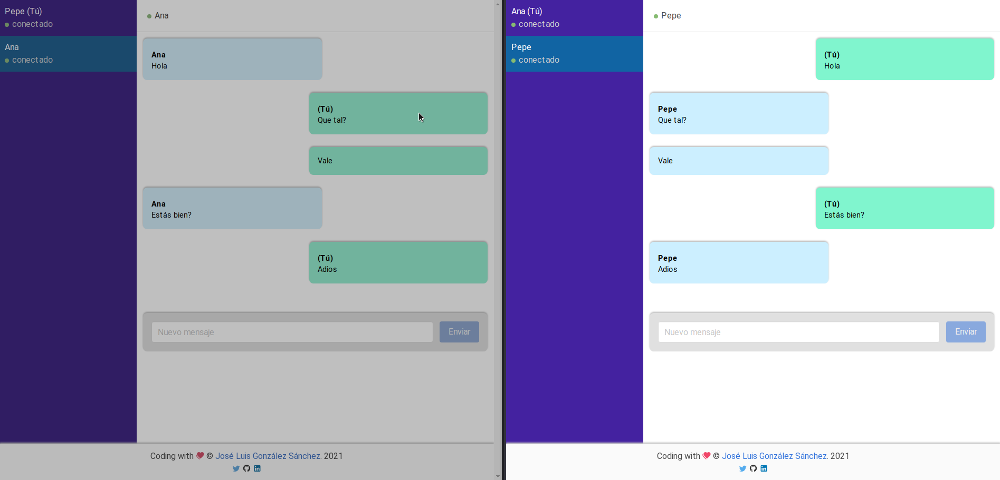

# Vue Chat Socket.io
Ejemplo de mensajería privada cliente servidor. Como cliente usaremos Vue.js, el servidor en Node.js. Usaremos la librería Socket.io. Todo ello con TypeScript.

[](https://es.vuejs.org/)
[](https://nodejs.org/es/)
[](https://www.typescriptlang.org/)
[](https://airbnb.io/javascript)
[](./LICENSE)


- [Vue Chat Socket.io](#vue-chat-socketio)
  - [Sobre el proyecto](#sobre-el-proyecto)
  - [Servidor](#servidor)
    - [Project setup](#project-setup)
    - [Compiles and hot-reloads for development](#compiles-and-hot-reloads-for-development)
    - [Compiles and minifies for production](#compiles-and-minifies-for-production)
    - [Compiles and start for production](#compiles-and-start-for-production)
    - [Lints and fixes files](#lints-and-fixes-files)
  - [Cliente](#cliente)
    - [Project setup](#project-setup-1)
    - [Compiles and hot-reloads for development](#compiles-and-hot-reloads-for-development-1)
    - [Compiles and minifies for production](#compiles-and-minifies-for-production-1)
    - [Lints and fixes files](#lints-and-fixes-files-1)
  - [Autor](#autor)
  - [Licencia](#licencia)


## Sobre el proyecto

El proyecto consiste en crar sistema de mensajería privada en tiempo real creando un cliente en Vue.js y un servidor en Node.js. Ambos trabajarán con la librería Socket.io. 

## Servidor
En la carpeta servidor, tienes el servidor creado. Para ello se ha usando Node.js con TypeScript.

### Project setup
```
npm install
```

### Compiles and hot-reloads for development
```
npm run dev:run
```

### Compiles and minifies for production
```
npm run build
```

### Compiles and start for production
```
npm run start
```

### Lints and fixes files
```
npm run lint:fix
```

## Cliente 
En la carpeta cliente, tienes el cliente creado. Creado con Vue.js con TypeScript y Bulma/Buefy.

### Project setup
```
npm install
```

### Compiles and hot-reloads for development
```
npm run serve
```

### Compiles and minifies for production
```
npm run build
```

### Lints and fixes files
```
npm run lint
```



## Autor

Codificado con :sparkling_heart: por [José Luis González Sánchez](https://twitter.com/joseluisgonsan)

[](https://twitter.com/joseluisgonsan)
[](https://github.com/joseluisgs)

## Licencia

Este proyecto esta licenciado bajo licencia **MIT**, si desea saber más, visite el fichero
[LICENSE](./LICENSE) para su uso docente y educativo.
