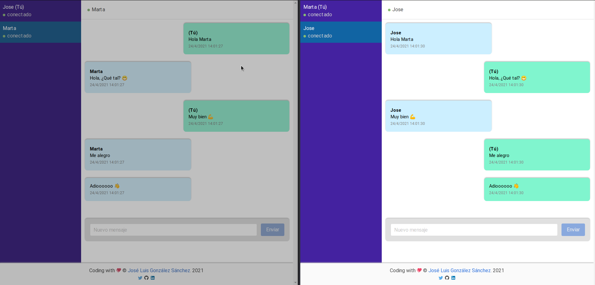
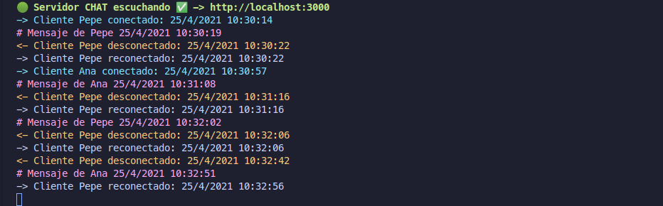

# Vue Chat Socket.io
Ejemplo de mensajería privada cliente servidor. Como cliente usaremos Vue.js, el servidor en Node.js. Usaremos la librería Socket.io. Todo ello con TypeScript.

[](https://es.vuejs.org/)
[](https://nodejs.org/es/)
[](https://www.typescriptlang.org/)
[](https://airbnb.io/javascript)
[](./LICENSE)


- [Vue Chat Socket.io](#vue-chat-socketio)
  - [Sobre el proyecto](#sobre-el-proyecto)
    - [Store y Persistencia](#store-y-persistencia)
      - [Sesiones](#sesiones)
      - [Mensajes](#mensajes)
    - [Arquitectura avanzada](#arquitectura-avanzada)
      - [Balaceador de carga](#balaceador-de-carga)
      - [Sesiones y mensajes](#sesiones-y-mensajes)
  - [Despliegue](#despliegue)
    - [Todo (recomendado)](#todo-recomendado)
    - [Servidor](#servidor)
    - [Cliente](#cliente)
    - [Redis](#redis)
  - [Servidor](#servidor-1)
    - [Project setup](#project-setup)
    - [Compiles and hot-reloads for development](#compiles-and-hot-reloads-for-development)
    - [Compiles and minifies for production](#compiles-and-minifies-for-production)
    - [Compiles and start for production](#compiles-and-start-for-production)
    - [Lints and fixes files](#lints-and-fixes-files)
  - [Cliente](#cliente-1)
    - [Project setup](#project-setup-1)
    - [Compiles and hot-reloads for development](#compiles-and-hot-reloads-for-development-1)
    - [Compiles and minifies for production](#compiles-and-minifies-for-production-1)
    - [Lints and fixes files](#lints-and-fixes-files-1)
  - [Autor](#autor)
  - [Licencia](#licencia)
  - [Agradecimientos](#agradecimientos)


## Sobre el proyecto

El proyecto consiste en crar sistema de mensajería privada en tiempo real creando un cliente en Vue.js y un servidor en Node.js. Ambos trabajarán con la librería Socket.io.

Tiene dos modos de funcionamiento, uno simple con sesiones y persistencia en memoria y uno avanzado, que hace uso de Redis para las sesiones y un cluster para el servidor.




### Store y Persistencia
Se ha implementado un Store tanto en cliente como en servidor para el manejo de la persistencia de la información.

En el modo avanzado se ha usado Redis para las sesiones y mensajes.

#### Sesiones
La sesiones se guardan en el servidor en base a un identificador único. De esta manera si un usuario recarga la página se volvería a conectar simpre que su sesión esté activa. En el cliente el identificador de la sesión se guarda en el almacenamiento local del navegador.

En el modo avanzado se ha usado Redis.

#### Mensajes
De la misma manera que guardamos las sesiones en el servidor. También vamos a guardar los mensajes. De esta manera, si un usuario se desconecta, podremos seguir mandándole mensajes, que le llegarán. De la misma manera si recarga su sesión recuperará todos los mensajes que tiene con sus contactos.

En el modo avanzado se ha usado Redis.

### Arquitectura avanzada

#### Balaceador de carga
Lo primero que crearemos es un balanceador de carga para [Socket.io](https://socket.io/docs/v4/using-multiple-nodes/#Sticky-load-balancing) creando un maestro y distintos workers al respecto.


#### Sesiones y mensajes
Se ha usado Redis para las sesiones usado Redis (HMGET) y para los Mensajes (RPUSH/LRANGE)


## Despliegue
El proyecto se puede desplegar usando Docker y consultando dichos docker en [Docker Hub](https://hub.docker.com/repositories). También puedes usar lso respectivos Dockerfiles o Docker Compose (recomendado).

### Todo (recomendado)
```
docker-compose up -d  
```

### Servidor
```
docker run -it -p 3000:3000 --rm --name vue-chat-socket-server joseluisgs/vue-chat-socket-server
```
### Cliente
```
docker run -it -p 8080:8080 --rm --name vue-chat-socket-client joseluisgs/vue-chat-socket-client
```
### Redis
```
docker-compose -f redis-compose.yml up -d
```

## Servidor
En la carpeta servidor, tienes el servidor creado. Para ello se ha usando Node.js con TypeScript. Dicho servidor realiza la persistencia de sesiones y mensajes de los usuarios.

En el modo avanzado se ha usado un cluster para poder atender a muuchas peticiones usando un balanceador de carga.

### Project setup
```
npm install
```

### Compiles and hot-reloads for development
```
npm run dev:run
```

### Compiles and minifies for production
```
npm run build
```

### Compiles and start for production
```
npm run start
```

### Lints and fixes files
```
npm run lint:fix
```

## Cliente 
En la carpeta cliente, tienes el cliente creado. Creado con Vue.js con TypeScript y Bulma/Buefy.

### Project setup
```
npm install
```

### Compiles and hot-reloads for development
```
npm run serve
```

### Compiles and minifies for production
```
npm run build
```

### Lints and fixes files
```
npm run lint
```

## Autor

Codificado con :sparkling_heart: por [José Luis González Sánchez](https://twitter.com/joseluisgonsan)

[](https://twitter.com/joseluisgonsan)
[](https://github.com/joseluisgs)

## Licencia

Este proyecto esta licenciado bajo licencia **MIT**, si desea saber más, visite el fichero
[LICENSE](./LICENSE) para su uso docente y educativo.

## Agradecimientos
Proyecto basado en parte de los ejemplos de [Socket.io](https://socket.io/get-started/private-messaging-part-1/)
